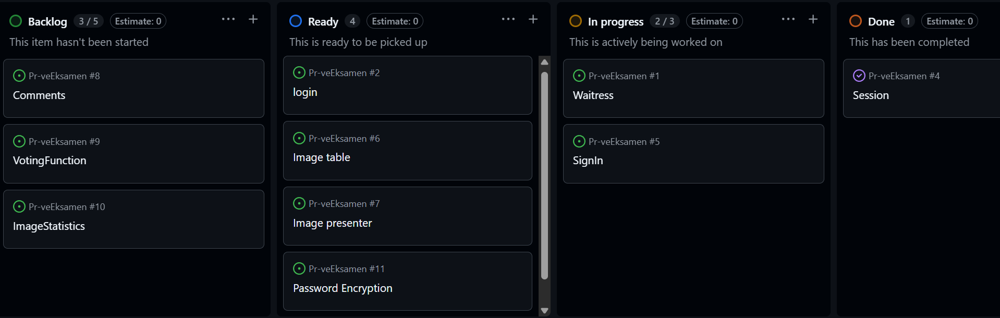

# Prosjektbeskrivelse og  dokumentasjon

##  Prosjekttittel
**Bildekonkurranse**

---

## 1. Prosjektidé og problemstilling

### Beskrivelse
Jeg skal lage en nettside som lar brukeren stemme mellom to og to bilder de liker og så se hvilken bilder som fikk flest stemmer.


## Hva skal jeg gjøre på Eksamensdagen

- Beskriv det du har planlagt å gjøre med ord 
- https://github.com/users/edmalema/projects/8/views/1
---
## 2. Systembeskrivelse

**Formål med applikasjonen:**\
*Målet er å stemme frem det beste bildet*

**Brukerflyt:**\
Brukeren blir først bedt om å registrere seg selv eller logge inn, etter de har gjort det så kan de starte en quiz der de blir vist to bilder og stemme på hvilket de likte mest, når de har stemt ett vist antall ganger så får de se hvordan alle bildene gjorde det mellom alle brukerne.

**Teknologier brukt:**

-   Python / Flask / Waitress\
-   MariaDB\
-   HTML / CSS / JS / Jinja\

------------------------------------------------------------------------

## 3. Server-, infrastruktur- og nettverksoppsett

### Servermiljø

*Debian*

### Nettverksoppsett

-   Nettverksdiagram
-   10.2.1.167\
-   5000\

Eksempel:

    Klient → Waitress(5000) → MariaDB

### Miljøvariabler og systemkrav

-   .env
-   .venv
-   requirements.txt

------------------------------------------------------------------------

## 4. Prosjektstyring -- GitHub Projects (Kanban)

-   Backlog / Ready / In Progress / Done\


Refleksjon: 
Kanban hjalp med å strukturere arbeidet og gi et tydelig mål for fremtiden
------------------------------------------------------------------------

## 5. Databasebeskrivelse

**Databasenavn: PrøveEksamen**

**Tabeller:**
+----------+--------------+------+-----+---------+----------------+
| Field    | Type         | Null | Key | Default | Extra          |
+----------+--------------+------+-----+---------+----------------+
| id       | int(11)      | NO   | PRI | NULL    | auto_increment |
| username | varchar(100) | YES  |     | NULL    |                |
| password | varchar(255) | YES  |     | NULL    |                |
+----------+--------------+------+-----+---------+----------------+

**SQL-eksempel:**

``` sql
CREATE TABLE Users (
  id INT AUTO_INCREMENT PRIMARY KEY,
  username VARCHAR(100),
  password VARCHAR(255)
);
```

------------------------------------------------------------------------

## 6. Programstruktur

    Prøveeksamen/
     ├── .venv
     ├── static/
     |   ├── Scripts
     |   └── Styles
     |       └── Styles.css
     ├── templates/
     |   ├── Login.html
     |   └── Ping.html
     ├── .env
     ├── .gitignore
     ├── app.py
     ├── Kanban.png
     ├── README.md
     └── requirements.txt

Databasestrøm:

    HTML/Jinja → Flask → MariaDB → Flask → HTML/Jinja

------------------------------------------------------------------------

## 7. Kodeforklaring

Forklar ruter og funksjoner (kort).

------------------------------------------------------------------------

## 8. Sikkerhet og pålitelighet

-   .env\
-   Miljøvariabler\
-   Parameteriserte spørringer\
-   Validering\
-   Feilhåndtering

------------------------------------------------------------------------

## 9. Feilsøking og testing

-   Typiske feil\
-   Hvordan du løste dem\
-   Testmetoder

------------------------------------------------------------------------

## 10. Konklusjon og refleksjon

-   Hva lærte du?\
-   Hva fungerte bra?\
-   Hva ville du gjort annerledes?\
-   Hva var utfordrende?

------------------------------------------------------------------------

## 11. Kildeliste

-   w3schools\
-   flask.palletsprojects.com
